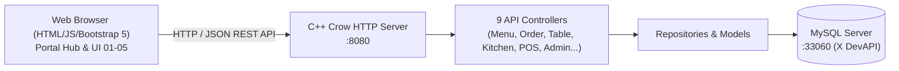

# 🍽️ Restaurant Order Management System — Group 07
> **Hệ thống Quản lý Nhà hàng & Điểm bán hàng chuyên nghiệp (SaaS POS)**  
> **Kiến trúc MVC 2.0 Full-Stack: C++ Crow REST API Server (Backend) + Modern Flat Light UI / Bootstrap 5 (Frontend)**

---

## 📌 MỤC LỤC
1. [Giới Thiệu Tổng Quan](#1-giới-thiệu-tổng-quan)
2. [Phân Công Thành Viên Nhóm 07](#2-phân-công-thành-viên-nhóm-07)
3. [Cấu Trúc Thư Mục Dự Án](#3-cấu-trúc-thư-mục-dự-án)
4. [Yêu Cầu Môi Trường (Prerequisites)](#4-yêu-cầu-môi-trường-prerequisites)
5. [Cài Đặt Cơ Sở Dữ Liệu MySQL](#5-cài-đặt-cơ-sở-dữ-liệu-mysql)
6. [Cấu Hình Biến Môi Trường (.env)](#6-cấu-hình-biến-môi-trường-env)
7. [Hướng Dẫn Biên Dịch & Chạy Ứng Dụng](#7-hướng-dẫn-biên-dịch--chạy-ứng-dụng)
   - [Cách 1: Chạy trực tiếp bằng Visual Studio 2022 (Khuyên Dùng)](#cách-1-chạy-trực-tiếp-bằng-visual-studio-2022-khuyên-dùng)
   - [Cách 2: Biên dịch bằng CMake CLI](#cách-2-biên-dịch-bằng-cmake-cli)
   - [Cách 3: Khởi chạy bằng Docker & Docker Compose](#cách-3-khởi-chạy-bằng-docker--docker-compose)
   - [Cách 4: Trải nghiệm nhanh giao diện Web (Mock Mode)](#cách-4-trải-nghiệm-nhanh-giao-diện-web-mock-mode)
8. [Danh Mục 5 Phân Hệ Giao Diện (Frontend)](#8-danh-mục-5-phân-hệ-giao-diện-frontend)
9. [Danh Mục REST API Kiểm Thử (cURL / Postman)](#9-danh-mục-rest-api-kiểm-thử-curl--postman)
10. [Xử Lý Sự Cố Thường Gặp (Troubleshooting)](#10-xử-lý-sự-cố-thường-gặp-troubleshooting)

---

## 1. Giới Thiệu Tổng Quan

Hệ thống **Restaurant Order Management System (Nhóm 07)** là ứng dụng quản lý điều hành nhà hàng trọn gói, được xây dựng theo mô hình kiến trúc chuẩn **MVC 2.0 (Tách rời hoàn toàn Backend C++ và Frontend Web)**:
- **Backend**: Sử dụng ngôn ngữ **C++17**, framework **Crow C++** đa luồng (multithreaded), thư viện **nlohmann/json** và driver **MySQL Connector C++ (X DevAPI)** giao tiếp cơ sở dữ liệu tốc độ cao.
- **Frontend**: Ngôn ngữ thiết kế phẳng chuẩn **Light Mode SaaS (CukCuk POS Style)**, sử dụng HTML5, CSS3 tinh giản (viền mỏng 1px, không bóng đổ dày, không gradient) cùng **Bootstrap 5.3** responsive trên mọi thiết bị.



---

## 2. Phân Công Thành Viên Nhóm 07

| Thành Viên | Phân Hệ Phụ Trách | Trách Nhiệm Backend (C++) | Trách Nhiệm Frontend / Docs |
| :--- | :--- | :--- | :--- |
| **Hoàng Hậu** | **UI-01: Đặt Món & Thực Đơn** | `MenuApiController`, `OrderApiController` | Giao diện POS 3 cột: Chọn bàn, lọc danh mục món, giỏ hàng, ghi chú món ăn |
| **Quốc Thăng** | **UI-02: Sơ Đồ Bàn & Đặt Chỗ** | `TableApiController`, `ServiceApiController`, `Validator` | Sơ đồ bàn trực quan phẳng (Trắng, Xanh, Vàng), hàng đợi chuông phục vụ, ERD & Class Diagram |
| **Gia Hưng** | **UI-03: Màn Hình Bếp KDS** | `KitchenApiController` | Bảng điều phối Kanban 4 cột (Chờ nấu, Đang nấu, Hoàn tất, Ra món), thiết kế `db/schema.sql` |
| **Hoài Phương** | **UI-04: Thu Ngân POS** | `PaymentApiController`, `ReportApiController` | Bảng hóa đơn viền mảnh, chiết khấu VIP 10%, VAT 8%, in phiếu thu, cấu hình `docker-compose.yml` |
| **Hà My** | **UI-05: Quản Trị & Báo Cáo** | `EmployeeApiController`, `InventoryApiController` | Quản lý nhân viên (UC13), quản lý kho tồn (UC14), báo cáo KPI, lập Testing Document |

---

## 3. Cấu Trúc Thư Mục Dự Án

```text
Group_7-Restaurant-Order-Management/
├── docs/                                 # Tài liệu phân tích thiết kế
│   ├── ERD.drawio                        # Sơ đồ quan hệ thực thể CSDL (Thăng)
│   └── ClassDiagram.png                  # Sơ đồ lớp chi tiết (Thăng)
│
├── db/                                   # Cơ sở dữ liệu (Hưng)
│   └── schema.sql                        # Script khởi tạo 8 bảng MySQL & nạp dữ liệu mẫu
│
├── frontend/                             # GIAO DIỆN WEB SAAS LIGHT MODE (CukCuk Style)
│   ├── index.html                        # Dashboard trung tâm có Sidebar 250px điều hướng
│   ├── style.css                         # CSS dùng chung cho Dashboard
│   ├── ui-01-order/                      # Phân hệ Đặt Món & Thực Đơn (Hậu)
│   │   ├── index.html, style.css, api_client.js
│   ├── ui-02-table/                      # Phân hệ Sơ Đồ Bàn & Đặt Chỗ (Thăng)
│   │   ├── index.html, style.css, api_client.js
│   ├── ui-03-kitchen/                    # Phân hệ Màn Hình Bếp KDS (Hưng)
│   │   ├── index.html, style.css, api_client.js
│   ├── ui-04-pos/                        # Phân hệ Thu Ngân & Hóa Đơn (Phương)
│   │   ├── index.html, style.css, api_client.js
│   └── ui-05-admin/                      # Phân hệ Quản Trị & Kho Hàng (My)
│       ├── index.html, style.css, api_client.js
│
├── src/                                  # C++ BACKEND SOURCE CODE
│   ├── database/                         # Quản lý kết nối MySQL qua X DevAPI
│   │   ├── Database.h, Database.cpp
│   ├── model/                            # 8 Thực thể dữ liệu nghiệp vụ
│   │   ├── Category, MenuItem, Table, Order, OrderItem, Invoice, Employee, Inventory
│   ├── repository/                       # 6 Lớp truy vấn CSDL (DAO)
│   │   ├── MenuRepository, TableRepository, OrderRepository,
│   │   ├── InvoiceRepository, EmployeeRepository, InventoryRepository
│   ├── controller/                       # 9 API Controller trả lời JSON
│   │   ├── MenuApiController, OrderApiController, TableApiController,
│   │   ├── ServiceApiController, KitchenApiController, PaymentApiController,
│   │   ├── EmployeeApiController, InventoryApiController, ReportApiController
│   ├── utils/                            # Hỗ trợ tuần tự hóa JSON & bẫy lỗi
│   │   ├── JsonHelper.h / .cpp, Validator.h / .cpp
│   └── main.cpp                          # Entry point khởi chạy Crow HTTP Server (Port 8080)
│
├── .env.example                          # File cấu hình mẫu môi trường CSDL
├── CMakeLists.txt                        # Cấu hình biên dịch CMake C++17
├── Dockerfile                            # Đóng gói container ứng dụng C++
├── docker-compose.yml                    # Khởi tạo đồng thời C++ API và MySQL Server
└── README.md                             # Hướng dẫn chi tiết thiết lập & vận hành
```

---

## 4. Yêu Cầu Môi Trường (Prerequisites)

Để biên dịch và chạy dự án, hệ thống của bạn cần chuẩn bị:
- **Hệ điều hành**: Windows 10/11, Linux (Ubuntu 20.04+), hoặc macOS.
- **Trình biên dịch C++**: Hỗ trợ chuẩn **C++17** trở lên:
  - Trên Windows: **Visual Studio 2022** (khuyên dùng, cài đặt workload *"Desktop development with C++"*).
  - Trên Linux/macOS: **GCC 9+** hoặc **Clang 10+**.
- **CMake**: Phiên bản `>= 3.15`.
- **MySQL Server**: Phiên bản **8.0** trở lên (hỗ trợ cổng MySQL X Protocol mặc định `33060` hoặc chuẩn `3306`).
- **MySQL Connector C++ 8.0 / 9.x** (Oracle X DevAPI): Đã cài đặt trên máy.
  - *Mặc định trên Windows nằm tại:* `C:\Program Files\MySQL\MySQL Connector C++ 26.7` (hoặc `MySQL Connector C++ 8.0`).
- **Trình duyệt Web**: Google Chrome, Microsoft Edge, Firefox, Brave...

> 💡 **Tự Động Tải Thư Viện**: Các thư viện **Crow C++** (Web Framework), **Asio** và **nlohmann/json** được CMake tự động tải về qua cơ chế `FetchContent`, bạn **không cần cài đặt thủ công**.

---

## 5. Cài Đặt Cơ Sở Dữ Liệu MySQL

Dự án sử dụng cơ sở dữ liệu `restaurant_db` gồm **8 bảng chuẩn hóa** (`Category`, `MenuItem`, `Tables`, `Employee`, `Orders`, `OrderItem`, `Invoice`, `Inventory`) cùng toàn bộ dữ liệu mẫu ban đầu.

### Cách 1: Sử dụng Terminal (CMD / PowerShell / Bash)
```bash
# Đăng nhập vào MySQL và nạp file db/schema.sql
mysql -u root -p < db/schema.sql
```

### Cách 2: Sử dụng MySQL Workbench / DBeaver / HeidiSQL
1. Mở công cụ quản lý cơ sở dữ liệu (ví dụ **MySQL Workbench**).
2. Mở file `db/schema.sql` từ thư mục dự án.
3. Nhấn nút **Execute** (hoặc tổ hợp phím **Ctrl + Shift + Enter**) để thực thi toàn bộ script.

---

## 6. Cấu Hình Biến Môi Trường (.env)

Hệ thống tự động tìm và nạp cấu hình từ file `.env`. Hãy tạo file `.env` tại thư mục gốc của dự án:

```bash
# Sao chép từ file mẫu
cp .env.example .env
```

Nội dung file `.env`:
```ini
DB_HOST=localhost
DB_PORT=33060
DB_USER=root
DB_PASSWORD=your_mysql_password
DB_NAME=restaurant_db
```
*(Thay `your_mysql_password` bằng mật khẩu tài khoản MySQL `root` của bạn).*

> 💡 **Cơ Chế Khởi Động An Toàn (Fault Tolerance)**: Nếu MySQL tạm thời chưa khởi động, server C++ Backend vẫn sẽ khởi chạy bình thường mà không bị crash. Các trang giao diện sẽ tự động chuyển sang chế độ **Mock Data** để bạn vẫn có thể trải nghiệm toàn bộ tính năng.

---

## 7. Hướng Dẫn Biên Dịch & Chạy Ứng Dụng

### Cách 1: Chạy trực tiếp bằng Visual Studio 2022 (Khuyên Dùng)

Đây là cách đơn giản và tiện lợi nhất trên Windows:

1. Khởi động **Visual Studio 2022**.
2. Chọn **Open a local folder** (Mở thư mục cục bộ) &rarr; chọn thư mục gốc `Group_7-Restaurant-Order-Management`.
3. Chờ Visual Studio hoàn tất tải cấu hình CMake (thanh trạng thái dưới cùng hiển thị *"CMake generation finished"*).
4. Tại thanh công cụ trên cùng:
   - Mục cấu hình chọn: `x64-Debug` hoặc `x64-Release`.
   - Mục mục tiêu khởi chạy (Startup Item) chọn: `restaurant_api.exe`.
5. Nhấn phím **`Ctrl + Shift + B`** (hoặc menu **Build &rarr; Build All**) để biên dịch.
6. Nhấn nút **Play xanh (hoặc phím F5)** để khởi chạy máy chủ.
7. Mở trình duyệt truy cập: **`http://localhost:8080/`**

> ⚠️ **Lưu ý quan trọng khi Rebuild**: Nếu Visual Studio báo lỗi `cannot open restaurant_api.exe for writing (LNK1168)`, hãy **tắt cửa sổ console của server cũ đang chạy** trước khi bấm Rebuild để Windows giải phóng file `.exe`.

---

### Cách 2: Biên dịch bằng CMake CLI

Nếu bạn muốn build dự án qua dòng lệnh PowerShell:

```powershell
# 1. Mở Developer PowerShell for VS (hoặc PowerShell thông thường)
# 2. Tạo thư mục build và cấu hình
mkdir build
cd build
cmake ..

# 3. Biên dịch chương trình
cmake --build . --config Release

# 4. Khởi chạy server
.\Release\restaurant_api.exe
```

Khi server khởi chạy thành công, terminal sẽ hiển thị:
```text
========================================================
  Restaurant Order Management System — Web API Server
  MVC 2.0 Full Architecture (C++ Backend + Web Frontend)
========================================================

[main] Starting Crow HTTP Server on port 8080...
[main] Web App Hub:   http://localhost:8080/
[main] UI-01 Order:   http://localhost:8080/ui-01-order/
[main] UI-02 Tables:  http://localhost:8080/ui-02-table/
[main] UI-03 Kitchen: http://localhost:8080/ui-03-kitchen/
[main] UI-04 POS:     http://localhost:8080/ui-04-pos/
[main] UI-05 Admin:   http://localhost:8080/ui-05-admin/

(INFO) Crow/master server is running at http://0.0.0.0:8080 using 12 threads
```

---

### Cách 3: Khởi chạy bằng Docker & Docker Compose

Nếu máy bạn đã cài sẵn **Docker Desktop**, bạn có thể chạy toàn bộ hệ thống (gồm cả MySQL Database và Backend C++) chỉ với 1 lệnh:

```bash
docker-compose up --build
```
Hệ thống Docker sẽ tự động dựng container MySQL, nạp `schema.sql`, build mã nguồn C++ và mở cổng `8080`.

---

### Cách 4: Trải nghiệm nhanh giao diện Web (Mock Mode)

Nếu bạn chỉ muốn kiểm tra giao diện người dùng mà chưa cài đặt trình biên dịch C++:
1. Mở thư mục `frontend/` trong máy tính.
2. **Nhấp đúp chuột trực tiếp vào file `frontend/index.html`** để mở trên trình duyệt.
3. Toàn bộ logic giao diện, dữ liệu món ăn, sơ đồ bàn, Kanban bếp, tính tiền hóa đơn sẽ tự động hoạt động mượt mà nhờ cơ chế **Mock Data Fallback** tích hợp sẵn trong các file `api_client.js`.

---

## 8. Danh Mục 5 Phân Hệ Giao Diện (Frontend)

Sau khi server chạy trên cổng `8080`, mở trình duyệt truy cập các liên kết:

| Phân Hệ | Đường Dẫn URL | Thành Viên | Tính Năng Nổi Bật |
| :--- | :--- | :--- | :--- |
| **Portal Hub (Trang Chủ)** | `http://localhost:8080/` | **Nhóm 07** | Dashboard SaaS phẳng, Sidebar 250px, thống kê doanh thu/bàn ăn/món nấu thời gian thực |
| **UI-01: Đặt Món** | `http://localhost:8080/ui-01-order/index.html` | **Hoàng Hậu** | Bố cục 3 cột CukCuk POS, lọc danh mục, tìm kiếm live, giỏ hàng ghi chú, gửi đơn xuống bếp |
| **UI-02: Sơ Đồ Bàn** | `http://localhost:8080/ui-02-table/index.html` | **Quốc Thăng** | Lưới bàn ăn chuẩn màu phẳng (Trắng = Trống, Xanh = Đang dùng, Vàng = Đặt trước), chuông gọi phục vụ |
| **UI-03: Màn Hình Bếp** | `http://localhost:8080/ui-03-kitchen/index.html` | **Gia Hưng** | Kanban KDS 4 cột: Chờ nấu &rarr; Đang nấu &rarr; Đã nấu xong &rarr; Đã ra món, nút bấm vuông vức |
| **UI-04: Thu Ngân POS** | `http://localhost:8080/ui-04-pos/index.html` | **Hoài Phương** | Bảng hóa đơn viền mảnh Bootstrap 5, chiết khấu VIP 10%, VAT 8%, thanh toán tiền mặt/POS/QR, in hóa đơn |
| **UI-05: Quản Trị Hệ Thống** | `http://localhost:8080/ui-05-admin/index.html` | **Hà My** | Bảng quản lý nhân viên (UC13), bảng kho hàng cảnh báo định mức tồn (UC14), báo cáo KPI |

---

## 9. Danh Mục REST API Kiểm Thử (cURL / Postman)

Bạn có thể sử dụng Postman hoặc Terminal để kiểm tra trực tiếp 9 Controller C++ Backend:

### 1. Kiểm tra trạng thái máy chủ (Health Check):
```bash
curl -X GET http://localhost:8080/api/health
```

### 2. Thực đơn & Món ăn:
```bash
# Lấy danh sách danh mục
curl -X GET http://localhost:8080/api/menu

# Lấy toàn bộ món ăn
curl -X GET http://localhost:8080/api/menu/items

# Lọc món theo danh mục (category_id = 1)
curl -X GET "http://localhost:8080/api/menu/items?category_id=1"
```

### 3. Tạo đơn hàng (Order):
```bash
curl -X POST http://localhost:8080/api/orders \
  -H "Content-Type: application/json" \
  -d '{
    "table_id": 2,
    "items": [
      { "item_id": 4, "quantity": 1, "special_note": "Bít tết chín vừa" },
      { "item_id": 6, "quantity": 2, "special_note": "Cà phê ít đường" }
    ]
  }'
```

### 4. Quản lý trạng thái bàn & Chuông phục vụ:
```bash
# Lấy danh sách bàn ăn
curl -X GET http://localhost:8080/api/tables

# Cập nhật trạng thái bàn sang "Occupied" (Bàn ID = 1)
curl -X PATCH http://localhost:8080/api/tables/1/status \
  -H "Content-Type: application/json" \
  -d '{"status": "Occupied"}'

# Gửi yêu cầu tính tiền từ bàn
curl -X POST http://localhost:8080/api/service/payment/request \
  -H "Content-Type: application/json" \
  -d '{"table_id": 2}'
```

### 5. Điều phối bếp (Kitchen KDS):
```bash
# Lấy danh sách món đang chờ nấu
curl -X GET http://localhost:8080/api/kitchen/items

# Đổi trạng thái món sang "Ready" (Món ID = 1)
curl -X PATCH http://localhost:8080/api/kitchen/items/1/status \
  -H "Content-Type: application/json" \
  -d '{"status": "Ready"}'
```

### 6. Thu ngân & Thanh toán:
```bash
# Tạm tính hóa đơn có giảm giá VIP 10%
curl -X POST http://localhost:8080/api/payment/check-bill \
  -H "Content-Type: application/json" \
  -d '{"order_id": 1, "is_vip": true, "discount_percent": 0.0}'

# Thanh toán xuất hóa đơn
curl -X POST http://localhost:8080/api/payment/checkout \
  -H "Content-Type: application/json" \
  -d '{
    "order_id": 1,
    "payment_method": "Cash",
    "discount_amount": 0.0,
    "final_amount": 32.50,
    "amount_paid": 50.0
  }'
```

### 7. Quản trị nhân sự & Kho hàng:
```bash
# Danh sách nhân viên
curl -X GET http://localhost:8080/api/employees

# Danh sách tồn kho nguyên liệu
curl -X GET http://localhost:8080/api/inventory

# Báo cáo tổng hợp kinh doanh
curl -X GET http://localhost:8080/api/reports/summary
```

---

## 10. Xử Lý Sự Cố Thường Gặp (Troubleshooting)

### Q1: Trình duyệt vẫn hiển thị giao diện tối màu cũ sau khi cập nhật?
- **Nguyên nhân**: Trình duyệt (Chrome / Edge) đang giữ bộ nhớ đệm (Cache) của trang `localhost:8080`.
- **Khắc phục**: Nhấn tổ hợp phím **`Ctrl + F5`** (hoặc **`Ctrl + Shift + R`**) trên trình duyệt để ép tải lại mới hoàn toàn, hoặc mở bằng một **Tab Ẩn danh (`Ctrl + Shift + N`)**.

### Q2: Visual Studio báo lỗi `cannot open restaurant_api.exe for writing (LNK1168)` khi Build?
- **Nguyên nhân**: Ứng dụng server cũ đang chạy ngầm và Windows đang khóa file `.exe`.
- **Khắc phục**: Nhấn nút **Dừng (Stop ⏹️)** trong Visual Studio, hoặc mở Task Manager / CMD thực hiện lệnh:
  ```cmd
  taskkill /F /IM restaurant_api.exe
  ```
  Sau đó nhấn **`Ctrl + Shift + B`** để biên dịch lại.

### Q3: Báo lỗi kết nối MySQL (`Connection attempt aborted / timeout`)?
- **Nguyên nhân**: Dịch vụ MySQL Server chưa được bật, hoặc mật khẩu/cổng trong file `.env` chưa chính xác.
- **Khắc phục**: 
  1. Mở `services.msc` kiểm tra dịch vụ **MySQL80** (hoặc MySQL) đang ở trạng thái *Running*.
  2. Đảm bảo cổng MySQL X Protocol `33060` (hoặc `3306`) đang mở.
  3. Kiểm tra lại thông tin tài khoản và mật khẩu trong file `.env`.

### Q4: Trùng cổng 8080 (`Port 8080 already in use`)?
- **Khắc phục**: Tắt ứng dụng đang chiếm cổng 8080, hoặc đổi cổng trong file [`src/main.cpp`](file:///d:/DoAn_Web_C++/Group_7-Restaurant-Order-Management/src/main.cpp) tại dòng `app.port(8080)` thành cổng mong muốn (ví dụ `app.port(8088)`).

---
*Dự án đồ án được phát triển bởi **Nhóm 07** — Môn Lập Trình & Thiết Kế Hướng Đối Tượng / Ứng Dụng Web C++.*
